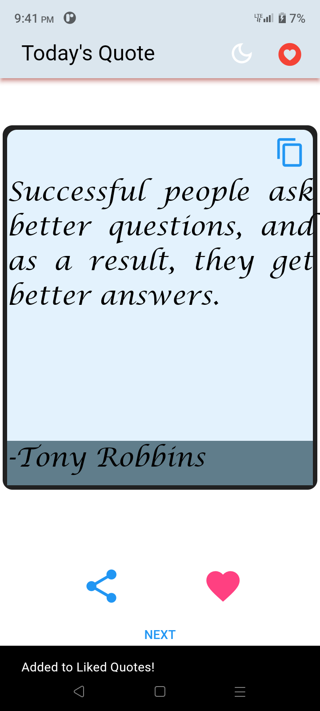
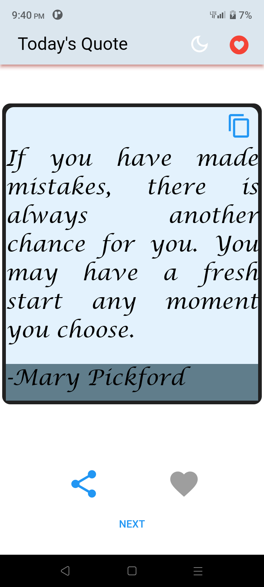
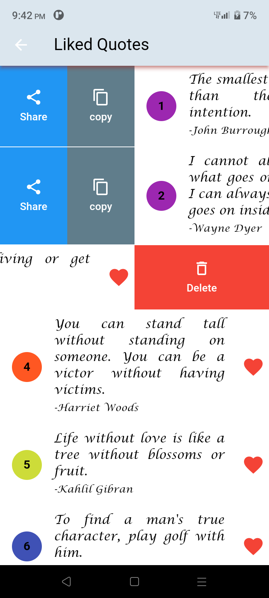
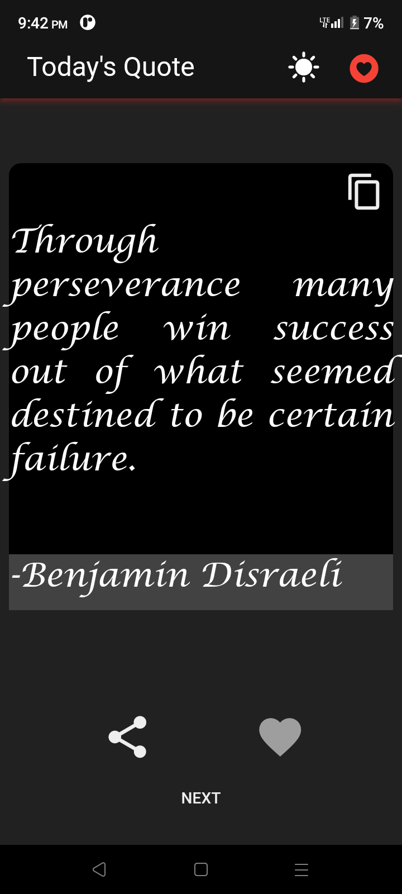
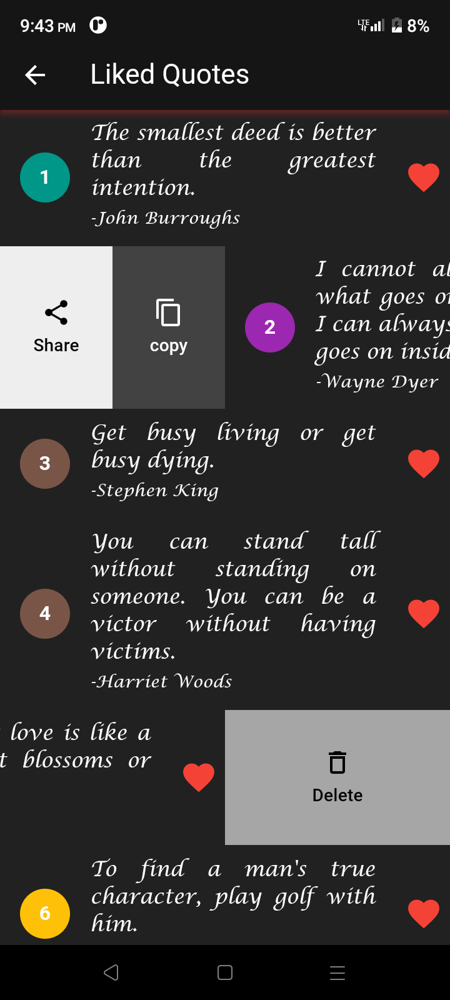

# Quote of the Day Flutter App | Quotes Inspire  

Welcome to the **Quote of the Day** app, a Flutter application designed to provide you with a daily dose of inspiration. The app fetches random quotes via a RESTful API and supports both light and dark themes. Users can like, share, and manage their favorite quotes, with offline storage capabilities for convenience.

## Features

- **Random Quotes**: Fetch and display random quotes from a RESTful API.
- **Themes**: Toggle between light and dark modes for a personalized experience.
- **Like Quotes**: Mark quotes as liked and view them in a separate list.
- **Share Quotes**: Share quotes with the author's name via social media or messaging apps.
- **Copy to Clipboard**: Copy quotes along with the author's name to the clipboard.
- **Offline Storage**: Save liked quotes offline using SQLite through `sqflite`.

## File Structure

Here’s a brief overview of the project file structure:

lib/
│
├── buttons/  
│   ├── [content_copy_button.dart](./lib/buttons/content_copy_button.dart)  
│   ├── [like_button.dart](./lib/buttons/like_button.dart)  
│   └── [share_button.dart](./lib/buttons/share_button.dart)  
│  
├── db/  
│   ├── [db_helper.dart](./lib/db/db_helper.dart)  
│   └── [quote.dart](./lib/db/quote.dart)  
│  
├── model/  
│   └── [model.dart](./lib/model/model.dart)  
│  
├── provider/  
│   └── [provider.dart](./lib/provider/theme_provider.dart)  
│  
├── screens/  
│   ├── [home.dart](./lib/screens/home.dart)  
│   └── [quotes_liked.dart](./lib/screens/quotes_liked.dart)  
│  
├── services/  
│   └── [remoteServices.dart](./lib/services/remoteServices.dart)  
│  
├── theme/  
│   ├── [dark_theme.dart](./lib/theme/dark_theme.dart)  
│   └── [light_theme.dart](./lib/theme/light_theme.dart)  
│  
├── [main.dart](./lib/main.dart)  
└── [sql_helper.dart](./lib/sql_helper.dart)  


## Dependencies

- **sqflite**: For offline data storage.
- **provider**: For state management.
- **http**: For making network requests.
- **flutter_localizations**: For supporting internationalization and localization.

## Setup

1. **Clone the repository**:
   ```bash
   git clone https://github.com/vinit105/quote_of_the_day.git

- [Lab: Write your first Flutter app](https://docs.flutter.dev/get-started/codelab)
- [Cookbook: Useful Flutter samples](https://docs.flutter.dev/cookbook)

For help getting started with Flutter development, view the
[online documentation](https://docs.flutter.dev/), which offers tutorials,
samples, guidance on mobile development, and a full API reference.

## Contributing
Contributions are welcome! To contribute:

- Fork the repository.
- Create a new branch (git checkout -b feature/YourFeature).
- Make your changes.
- Commit your changes (git commit -am 'Add some feature').
- Push to the branch (git push origin feature/YourFeature).
- Create a Pull Request.


## Screenshots

<div>
  
  
  
  
  
</div>  

## Demo 

[](https://github.com/user-attachments/assets/cd6c25d5-3be4-47d2-aa6a-f5801d7daff2)
